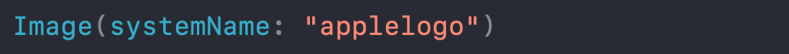
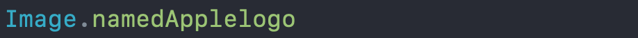

# Symbolicator

### Currently compatible for SF Symbol 3

This is a simple Playground that is used to generate SF Symbols extension files on String or on Image for swiftUI.

### example for swiftUI:

instead of writing:  

  

 

with the String extention you can write:

    

       

and with the Image extension you can write:

  

 

I used "named" as prefix because some of the SF Symbols names start with numbers, but you can easly use the prefix you want when you generate the code.

That's usefull to avoid typo error and also for discoverability with Xcode autocompletion.
